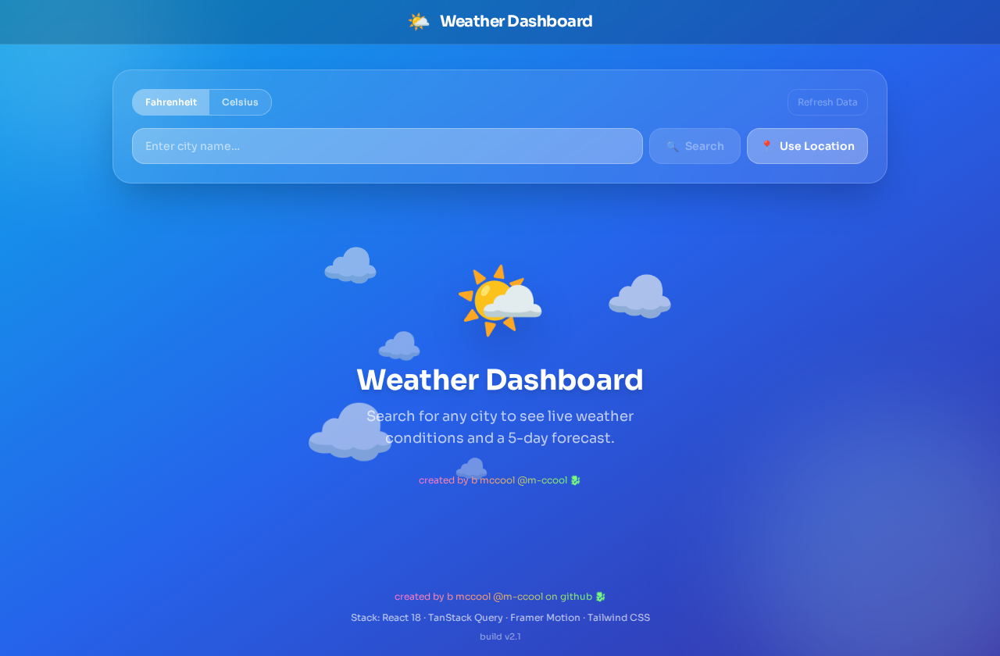

# Weather Dashboard

Modern weather dashboard built with React and deployed on GitHub Pages. Search by city, use current location, view current conditions plus a 5-day forecast, and switch between Fahrenheit/Celsius.

## Live Demo

- Deployed App: [https://m-ccool.github.io/weather-dashboard/](https://m-ccool.github.io/weather-dashboard/)

## Screenshot



## Features

- City search with persistent search history
- Current location weather via browser geolocation
- Current conditions and 5-day forecast
- Fahrenheit/Celsius unit toggle
- Skeleton shimmer loading states
- Animated gradient UI with motion transitions
- Module-level error boundaries to prevent full-page crashes

## Tech Stack

- React 18
- Vite
- Tailwind CSS
- Framer Motion
- TanStack Query
- Day.js
- OpenWeather API

## Getting Started

### Prerequisites

- Node.js 18+
- npm

### Install

```bash
npm install
```

### Run Locally

```bash
npm run dev
```

### Build

```bash
npm run build
```

## Deployment

This project is deployed to GitHub Pages.

```bash
npm run deploy
```

## Project Structure

```text
src/
	components/
	hooks/
	utils/
	App.jsx
	main.jsx
```

## Roadmap

- Hourly forecast module
- Air quality module
- Weather alert notifications

## License

Licensed under the terms in [LICENSE](LICENSE).

## Author

- GitHub: [@m-ccool](https://github.com/m-ccool)

